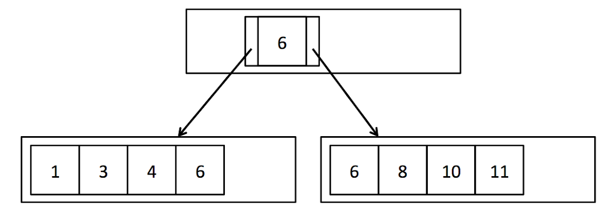
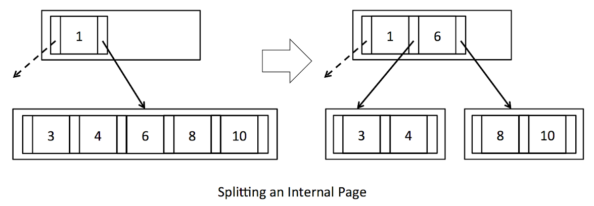
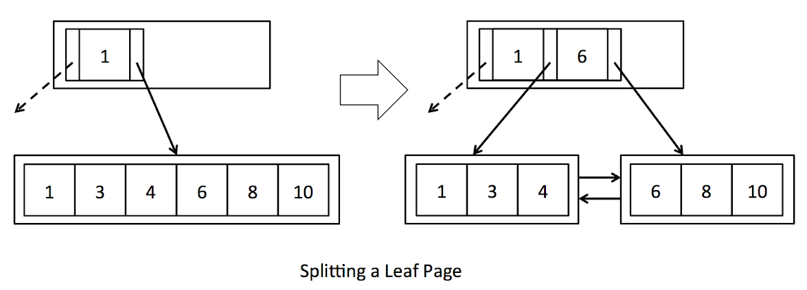
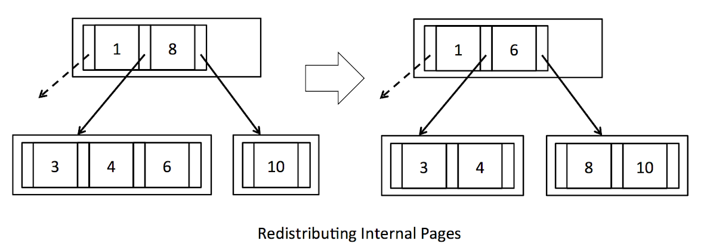
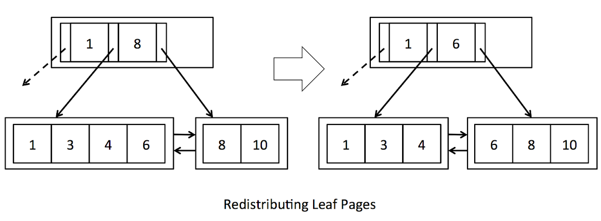
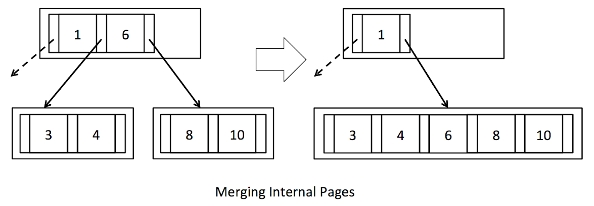
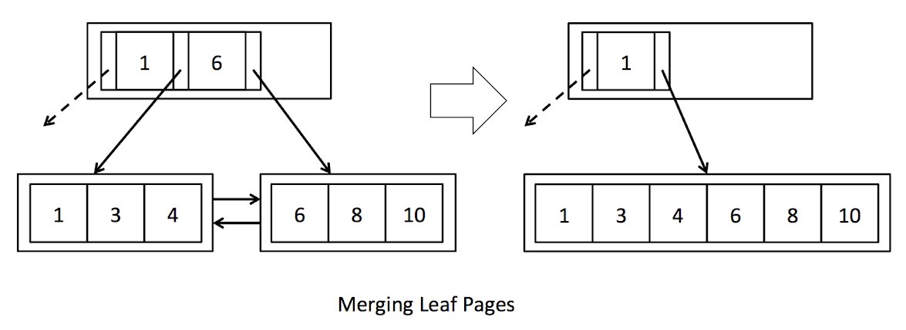

# Programming Assignment 2

In this assignment you will implement the page replacement procedure in the buffer and a B+ tree index for efficient
lookups and range scans. We supply you with all the low-level code you will need to implement the tree structure. You
will implement searching, splitting pages, redistributing tuples between pages, and merging pages (the last two are
optional).

The remainder of this document gives some suggestions about how to start coding, describes a set of exercises to help
you work through the assignment, and discusses how to hand in your code. This assignment requires you to write a fair
amount of code, so we encourage you to start early!

## Page eviction for SimpleDB Buffer

In assignment 2, you will choose a page eviction policy and instrument any previous code that reads or creates pages to
implement your policy.

When more than numPages pages are in the buffer pool, one page should be evicted from the pool before the next is
loaded. The choice of eviction policy is up to you; it is not necessary to do something sophisticated. Describe your
policy in the writeup. You need to implement a `BufferPool::flushAllPages` method. This is not something you would ever
need in a real implementation of a buffer pool. However, we need this method for testing purposes. You should never call
this method from any real code.

You will need to ensure that your `flushPage` and `flushAllPages` methods do not evict pages from the buffer pool to
properly pass this test. `flushAllPages` should call `flushPage` on all pages in the `BufferPool`, and `flushPage`
should write any dirty page to disk and mark it as not dirty, while leaving it in the `BufferPool`. The only method
which should remove page from the buffer pool is `evictPage`, which should call `flushPage` on any dirty page it evicts.

## Search in B+ Tree

Take a look at [BTreeFile](../include/db/BTreeFile.h). This is the core file for the implementation of the B+Tree and
where you will write all your code for this assignment. Unlike the HeapFile, the BTreeFile consists of four different
kinds of pages. As you would expect, there are two different kinds of pages for the nodes of the tree: internal pages
and leaf pages. Internal pages are implemented in [BTreeInternalPage](../include/db/BTreeInternalPage.h), and leaf pages
are implemented in [BTreeLeafPage](../include/db/BTreeLeafPage.h). For convenience, we have created an abstract class
in [BTreePage](../include/db/BTreePage.h) which contains code that is common to both leaf and internal pages. In
addition, header pages are implemented in [BTreeHeaderPage](../include/db/BTreeHeaderPage.h) and keep track of which
pages in the file are in use. Lastly, there is one page at the beginning of every `BTreeFile` which points to the root
page of the tree and the first header page. This singleton page is implemented
in [BTreeRootPtrPage](../include/db/BTreeRootPtrPage.h). Familiarize yourself with the interfaces of these classes,
especially `BTreePage`, `BTreeInternalPage` and `BTreeLeafPage`. You will need to use these classes in your
implementation of the B+Tree.

Your first job is to implement the `BTreeFile::findLeafPage` function. This function is used to find the appropriate
leaf page given a particular key value, and is used for both searches and inserts. For example, suppose we have a B+Tree
with two leaf pages (See *Figure 1*). The root node is an internal page with one entry containing one key (6, in this
case) and two child pointers. Given a value of 1, this function should return the first leaf page. Likewise, given a
value of 8, this function should return the second page. The less obvious case is if we are given a key value of 6.
There may be duplicate keys, so there could be 6's on both leaf pages. In this case, the function should return the
first (left) leaf page.

<figure>
  
  <figcaption>Figure 1: A simple B+ Tree with duplicate keys</figcaption>
</figure>

Your `findLeafPage` function should search through internal nodes until it reaches the leaf page corresponding to the
provided key value. In order to find the appropriate child page at each step, you should iterate through the entries in
the internal page and compare the entry value to the provided key value. `BTreeInternalPageIterator` provides access to
the entries in the internal page using the interface defined in [BTreeEntry](../include/db/BTreeEntry.h). This iterator
allows you to iterate through the key values in the internal page and access the left and right child page ids for each
key. The function returns when the passed-in `BTreePageId` has `type` equal to `BTreePageId::LEAF`, indicating that it
is a leaf page. In this case, you should just fetch the page from the buffer pool and return it. You do not need to
confirm that it actually contains the provided key value.

Your `findLeafPage` code must also handle the case a key value is not provided. In this case, go to the left-most child
every time in order to find the left-most leaf page. Finding the left-most leaf page is useful for scanning the entire
file. Once the correct leaf page is found, you should return it. As mentioned above, you can check the type of page
using the `type` function in [BTreePageId](../include/db/BTreePageId.h). You can assume that only leaf and internal
pages will be passed to this function.

Instead of directly calling `BufferPool::getPage` to get each internal page and leaf page, we recommend calling the
wrapper function we have provided, `BTreeFile::getPage`. It works exactly like `BufferPool::getPage`, but takes an extra
argument to track the list of dirty pages. This function will be important for the next two exercises in which you will
actually update the data and therefore need to keep track of dirty pages.

Every internal (non-leaf) page your `findLeafPage` implementation visits should be fetched with `READ_ONLY` permission,
except the returned leaf page, which should be fetched with the permission provided as an argument to the function.
These permission levels will not matter for this assignment, but they will be important for the code to function
correctly in future works.

Also note that as part of this implementation, you will need to
implement [IndexPredicate](../include/db/IndexPredicate.h) and [Predicate](../include/db/Predicate.h) in order to
support comparison operations.

## Insert in B+ Tree

In order to keep the tuples of the B+Tree in sorted order and maintain the integrity of the tree, we must insert tuples
into the leaf page with the enclosing key range. As was mentioned above, `findLeafPage` can be used to find the correct
leaf page into which we should insert the tuple. However, each page has a limited number of slots, and we need to be
able to insert tuples even if the corresponding leaf page is full.

Attempting to insert a tuple into a full leaf page should cause that page to split so that the tuples are evenly
distributed between the two new pages. Each time a leaf page splits, a new entry corresponding to the first tuple in the
second page will need to be added to the parent node. Occasionally, the internal node may also be full and unable to
accept new entries. In that case, the parent should split and add a new entry to its parent. This may cause splits and
ultimately the creation of a new root node.

In this exercise you will implement `splitLeafPage` and `splitInternalPage` in [BTreeFile](../include/db/BTreeFile.h).
If the page being split is the root page, you will need to create a new internal node to become the new root page, and
update the `BTreeRootPtrPage`. Otherwise, you will need to fetch the parent page with READ_WRITE permissions, split it
if necessary, and add a new entry. You will find the function `getParentWithEmptySlots` extremely useful for handling
these different cases. In `splitLeafPage` you should "copy" the key up to the parent page, while in `splitInternalPage`
you should "push" the key up to the parent page. See *Figure 2* and review lecture slides and section 10.5 in the text
book if this is confusing. Remember to update the parent pointers of the new pages as needed (for simplicity, we do not
show parent pointers in the figures). When an internal node is split, you will need to update the parent pointers of all
the children that were moved. You may find the function updateParentPointers() useful for this task. Additionally,
remember to update the sibling pointers of any leaf pages that were split. Finally, return the page into which the new
tuple or entry should be inserted, as indicated by the provided key field. (Hint: You do not need to worry about the
fact that the provided key may actually fall in the exact center of the tuples/entries to be split. You should ignore
the key during the split, and only use it to determine which of the two pages to return.)

<figure>
  
  
  <figcaption>Figure 2: Splitting pages</figcaption>
</figure>

Whenever you create a new page, either because of splitting a page or creating a new root page, call `getEmptyPage` to
get the new page. This function is an abstraction which will allow us to reuse pages that have been deleted due to
merging (covered in the next section).

We expect that you will interact with leaf and internal pages using `BTreeLeafPageIterator` and
`BTreeInternalPageIterator` to iterate through the tuples/entries in each page. For convenience, we have also provided
reverse iterators for both types of pages: `BTreeLeafPageReverseIterator` and `BTreeInternalPageReverseIterator`.
These reverse iterators will be especially useful for moving a subset of tuples/entries from a page to its right
sibling.

As mentioned above, the internal page iterators use the interface defined in [BTreeEntry](../include/db/BTreeEntry.h),
which has one key and two child pointers. It also has a recordId, which identifies the location of the key and child
pointers on the underlying page. We think working with one entry at a time is a natural way to interact with internal
pages, but it is important to keep in mind that the underlying page does not actually store a list of entries, but
stores ordered lists of *m* keys and *m+1* child pointers. Since the `BTreeEntry` is just an interface and not an object
actually stored on the page, updating the fields of `BTreeEntry` will not modify the underlying page. In order to change
the data on the page, you need to call `BTreeInternalPage::updateEntry`. Furthermore, deleting an entry actually deletes
only a key and a single child pointer, so we provide the functions `BTreeInternalPage::deleteKeyAndLeftChild` and
`BTreeInternalPage::deleteKeyAndRightChild` to make this explicit. The entry's recordId is used to find the key and
child pointer to be deleted. Inserting an entry also only inserts a key and single child pointer (unless it's the first
entry), so `BTreeInternalPage::insertEntry` checks that one of the child pointers in the provided entry overlaps an
existing child pointer on the page, and that inserting the entry at that location will keep the keys in sorted order.

In both `splitLeafPage` and `splitInternalPage`, you will need to update the set of `dirtypages` with any newly created
pages as well as any pages modified due to new pointers or new data. This is where `BTreeFile::getPage` will come in
handy. Each time you fetch a page, `BTreeFile::getPage` will check to see if the page is already stored in the local
cache (`dirtypages`), and if it can't find the requested page there, it fetches the page from the buffer pool.
`BTreeFile::getPage` also adds pages to the `dirtypages` cache if they are fetched with read-write permission, since
presumably they will soon be dirtied.

Note that in a major departure from `HeapFile::insertTuple`, `BTreeFile::insertTuple` could return a large set of dirty
pages, especially if any internal pages are split. As you may remember from previous assignment, the set of dirty pages
is returned to prevent the buffer pool from evicting dirty pages before they have been flushed.

**Warning**: as the B+Tree is a complex data structure, it is helpful to understand the properties necessary of every
legal B+Tree before modifying it. Here is an informal list:

1. If a parent node points to a child node, the child nodes must point back to those same parents.

2. If a leaf node points to a right sibling, then the right sibling points back to that leaf node as a left sibling.

3. The first and last leaves must point to null left and right siblings respectively.

4. `RecordId`'s must match the page they are actually in.

5. A key in a node with non-leaf children must be larger than any key in the left child, and smaller than any key in the
   right child.

6. A key in a node with leaf children must be larger or equal than any key in the left child, and smaller or equal than
   any key in the right child.

7. A node has either all non-leaf children, or all leaf children.

8. A non-root node cannot be less than half full.

## Bonus: Delete in B+ Tree

This part is not required but if you can pass the tests you will earn some extra credits!

In order to keep the tree balanced and not waste unnecessary space, deletions in a B+Tree may cause pages to
redistribute tuples (*Figure 3*) or, eventually, to merge (see *Figure 4*).

<figure>
  
  
  <figcaption>Figure 3: Redistributing pages</figcaption>
</figure>

<figure>
  
  
  <figcaption>Figure 4: Merging pages</figcaption>
</figure>

Attempting to delete a tuple from a leaf page that is less than half full should cause that page to either steal tuples
from one of its siblings or merge with one of its siblings. If one of the page's siblings has tuples to spare, the
tuples should be evenly distributed between the two pages, and the parent's entry should be updated accordingly (see
*Figure 3*). However, if the sibling is also at minimum occupancy, then the two pages should merge and the entry deleted
from the parent (*Figure 4*). In turn, deleting an entry from the parent may cause the parent to become less than half
full. In this case, the parent should steal entries from its siblings or merge with a sibling. This may cause merges or
even deletion of the root node if the last entry is deleted from the root node.

In this exercise you will implement stealFromLeafPage(), stealFromLeftInternalPage(), stealFromRightInternalPage(),
mergeLeafPages() and mergeInternalPages() in BTreeFile.java. In the first three functions you will implement code to
evenly redistribute tuples/entries if the siblings have tuples/entries to spare. Remember to update the corresponding
key field in the parent (look carefully at how this is done in *Figure 3* - keys are effectively "rotated" through the
parent). In stealFromLeftInternalPage()/stealFromRightInternalPage(), you will also need to update the parent pointers
of the children that were moved. You should be able to reuse the function updateParentPointers() for this purpose.

In mergeLeafPages() and mergeInternalPages() you will implement code to merge pages, effectively performing the inverse
of splitLeafPage() and splitInternalPage(). You will find the function deleteParentEntry() extremely useful for handling
all the different cases. Be sure to call setEmptyPage() on deleted pages to make them available for reuse. As with the
previous exercises, we recommend using BTreeFile.getPage() to encapsulate the process of fetching pages and
keeping the list of dirty pages up to date.

## Exercises

Implement the methods as indicated by the `// TODO pa2.x` comments in the following files:

- Predicate ([header](../include/db/Predicate.h) & [implementation](../db/Predicate.cpp))
- IndexPredicate ([header](../include/db/IndexPredicate.h) & [implementation](../db/IndexPredicate.cpp))
- BufferPool ([implementation](../db/BufferPool.cpp))
- BTreeFile ([implementation](../db/BTreeFile.cpp))

### Exercise 1: Buffer Pool flush

Implement:

- `BufferPool::evictPage`
- `BufferPool::flushAllPages`
- `BufferPool::discardPage`
- `BufferPool::flushPage`
- `BufferPool::flushPages`

### Exercise 2: Find Leaf

Add private members:

- `Predicate`
- `IndexPredicate`

Implement:

- `Predicate::Predicate`
- `Predicate::getField`
- `Predicate::getOp`
- `Predicate::getOperand`
- `Predicate::filter`
- `IndexPredicate::IndexPredicate`
- `IndexPredicate::getField`
- `IndexPredicate::getOp`
- `IndexPredicate::operator==`
- `std::hash<IndexPredicate>::operator()`
- `BTreeFile::findLeafPage`

### Exercise 3: Splitting Pages

Implement:

- `BTreeFile::splitLeafPage`
- `BTreeFile::splitInternalPage`
- `BufferPool::insertTuple`
- `BufferPool::deleteTuple`

### Exercise 4: Redistributing Pages (Bonus)

Implement:

- `BTreeFile::stealFromLeafPage`
- `BTreeFile::stealFromLeftInternalPage`
- `BTreeFile::stealFromRightInternalPage`

### Exercise 5: Merging Pages (Bonus)

Implement:

- `BTreeFile::mergeLeafPages`
- `BTreeFile::mergeInternalPages`
