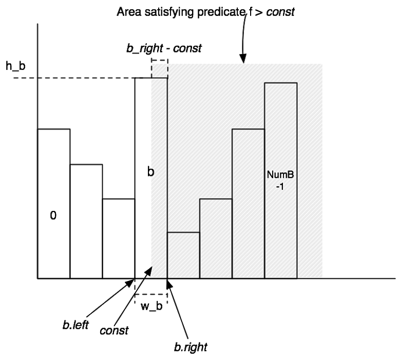

# Programming Assignment 4

## Statistics Estimation

Accurately estimating plan cost is quite tricky. In this assignment, we will focus only on the cost of sequences of
joins and base table accesses. We won't worry about access method selection (since we only have one access method, table
scans) or the costs of additional operators (like aggregates). You are only required to consider left-deep plans for
this assignment.

### Overall Plan Cost

We will write join plans of the form `p = t1 join t2 join ... tn` , which signifies a left deep join where t1 is the
left-most join (deepest in the tree). Given a plan like p, its cost can be expressed as:

```
scancost(t1) + scancost(t2) + joincost(t1 join t2) +
scancost(t3) + joincost((t1 join t2) join t3) +
... 
```

Here, `scancost(t1)` is the I/O cost of scanning table `t1`, `joincost(t1, t2)` is the CPU cost to join `t1` to `t2`. To
make I/O and CPU cost comparable, typically a constant scaling factor is used, e.g.:

```
cost(predicate application) = 1
cost(pageScan) = SCALING_FACTOR x cost(predicate application)
```

For this assignment, you can ignore the effects of caching (e.g., assume that every access to a table incurs the full
cost of a scan). Therefore, `scancost(t1)` is simply the number of pages in `t1 x SCALING_FACTOR`.

### Join Cost

When using nested loops joins, recall that the cost of a join between two tables t1 and t2 (where t1 is the outer) is
simply:

```
joincost(t1 join t2) = scancost(t1) + ntups(t1) x scancost(t2) // IO cost
                       + ntups(t1) x ntups(t2)  // CPU cost
```

Here, `ntups(t1)` is the number of tuples in table t1.

### Filter Selectivity

`ntups` can be directly computed for a base table by scanning that table. Estimating `ntups` for a table with one or
more selection predicates over it can be trickier -- this is the filter/selection selectivity estimation problem. Here's
one approach that you might use, based on computing a histogram over the values in the table:

- Compute the *minimum* and *maximum* values for every attribute in the table (by scanning it once).
- Construct a histogram for every attribute in the table. A simple approach is to use a fixed number of buckets `NumB`,
  with each bucket representing the number of records in a fixed range of the domain of the attribute of the histogram.
  For example, if a field `f` ranges from 1 to 100, and there are 10 buckets, then bucket 1 might contain the count of
  the number of records between 1 and 10, bucket 2 a count of the number of records between 11 and 20, and so on. Note
  that this is simply an equi-width histogram.
- Scan the table again, to populate the counts of the buckets in each histogram.
- To estimate the selectivity of an equality expression, `f = c`, compute the bucket that contains value const.
  Suppose the width (range of values) of the bucket is `w`, the height (number of tuples) is `h`, and the number of
  tuples in the table is `ntups`. Then, assuming values are uniformly distributed throughout the bucket, the selectivity
  of the expression is roughly `(h / w) / ntups`, since `h / w` represents the expected number of tuples in the bin with
  value `c`.
- To estimate the selectivity of a range expression `f > c`, compute the bucket `b` that `c` is in, with width `w_b` and
  height `h_b`. Then, `b` contains a fraction `b_f = h_b / ntups` of the total tuples. Assuming tuples are uniformly
  distributed throughout `b`, the fraction `b_part` of `b` that is `> c` is `(b_right - const) / w_b`, where `b_right`
  is the right endpoint of `b`'s bucket. Thus, bucket `b` contributes `b_f x b_part` selectivity to the predicate. In
  addition, buckets `b+1 ... NumB-1` contribute all of their selectivity (which can be computed using a formula similar
  to `b_f` above). Summing the selectivity contributions of all the buckets will yield the overall selectivity of the
  expression. *Figure 1* illustrates this process.
- Selectivity of expressions involving less than can be performed similar to the greater than case, looking at buckets
  down to 0.

<figure>
  
  <figcaption>Figure 1: Diagram illustrating the histograms you will implement in PA 4.</figcaption>
</figure>

### Join Cardinality

Finally, observe that the cost for the join plan `p` above includes expressions of the form `joincost((t1 join t2) join
t3)`. To evaluate this expression, you need some way to estimate the size `ntups` of `t1 join t2`. This join cardinality
estimation problem is harder than the filter selectivity estimation problem. In this assignment, you aren't required to
do anything fancy for this. Although it is possible to do a histogram-based method for join selectivity estimation, this
is not required.

While implementing, you should keep in mind the following:

- For equality joins, when one of the attributes is a primary key, the number of tuples produced by the join cannot be
  larger than the cardinality of the non-primary key attribute.
- For equality joins when there is no primary key, it's hard to say much about what the size of the output is -- it
  could be the size of the product of the cardinalities of the tables (if both tables have the same value for all
  tuples) -- or it could be 0. It's fine to make up a simple heuristic (say, the size of the larger of the two tables).
- For range scans, it is similarly hard to say anything accurate about sizes. The size of the output should be
  proportional to the sizes of the inputs. It is fine to assume that a fixed fraction of the cross-product is emitted by
  range scans (say, 30%). In general, the cost of a range join should be larger than the cost of a non-primary key
  equality join of two tables of the same size.

### Join Ordering

Now that you have implemented methods for estimating costs, you will implement the query optimizer. For these methods,
joins are expressed as a list of join nodes (e.g., predicates over two tables).

```
v = set of join nodes
for (i in 1...|v|):
  for s in {all length i subsets of v}
    bestPlan = {}
    for s' in {all length i-1 subsets of s}
      subplan = optjoin(s')
      plan = best way to join (s-s') to subplan
      if (cost(plan) < cost(bestPlan))
        bestPlan = plan
    optjoin(s) = bestPlan
return optjoin(v)
```

To help you implement this algorithm, we have provided several classes and methods to assist you.

- The method `JoinOptimizer::enumerateSubsets` will return a set of the subsets of `v`. This method is not particularly
  efficient; you can try to implement a more efficient enumerator, but this is not required.
- The method `computeCostAndCardOfSubplan` computes the best way to join nodes. It returns this best method in a
  `CostCard` object, which includes the cost, cardinality, and best join ordering (as a vector).
  This method may return `std::nullopt`, if no plan can be found (because, for example, there is no left-deep join that
  is possible), or if there is no optimal cost. The method uses a cache of previous joins called (optjoin in the
  pseudocode above).
- The class PlanCache can be used to cache the best way to join a subset of the joins considered so far.

You will have to implement `JoinOptimizer::orderJoins`. This method should operate on the joins class member, returning
a vector that specifies the order in which joins should be done. Item 0 of this vector indicates the left-most,
bottom-most join in a left-deep plan. Adjacent joins in the returned vector should share at least one field to ensure
the plan is left-deep

## Exercises

Implement:
- `IntHistogram::estimateSelectivity`
- `JoinOptimizer::estimateJoinCost`
- `JoinOptimizer::estimateTableJoinCardinality`
- `JoinOptimizer::orderJoins`
